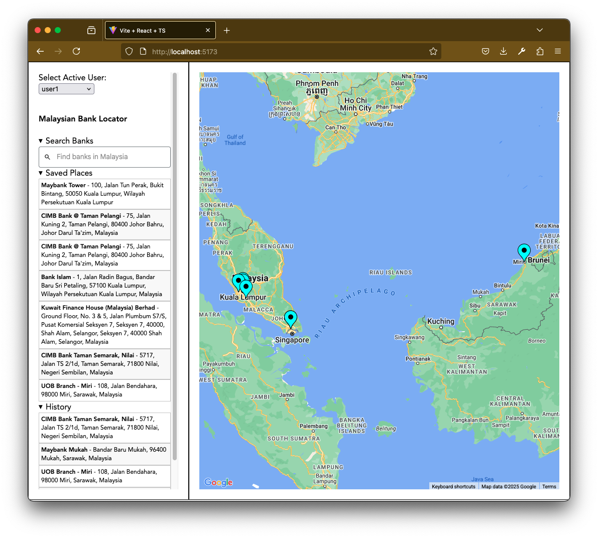
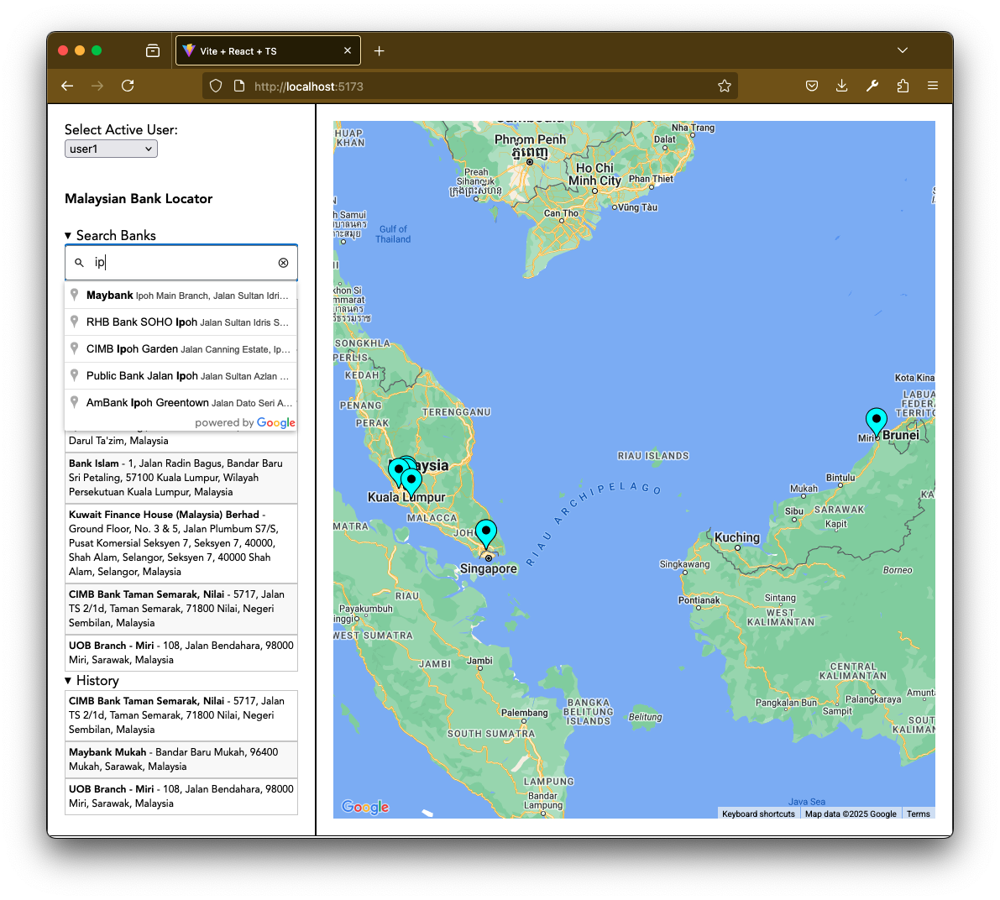
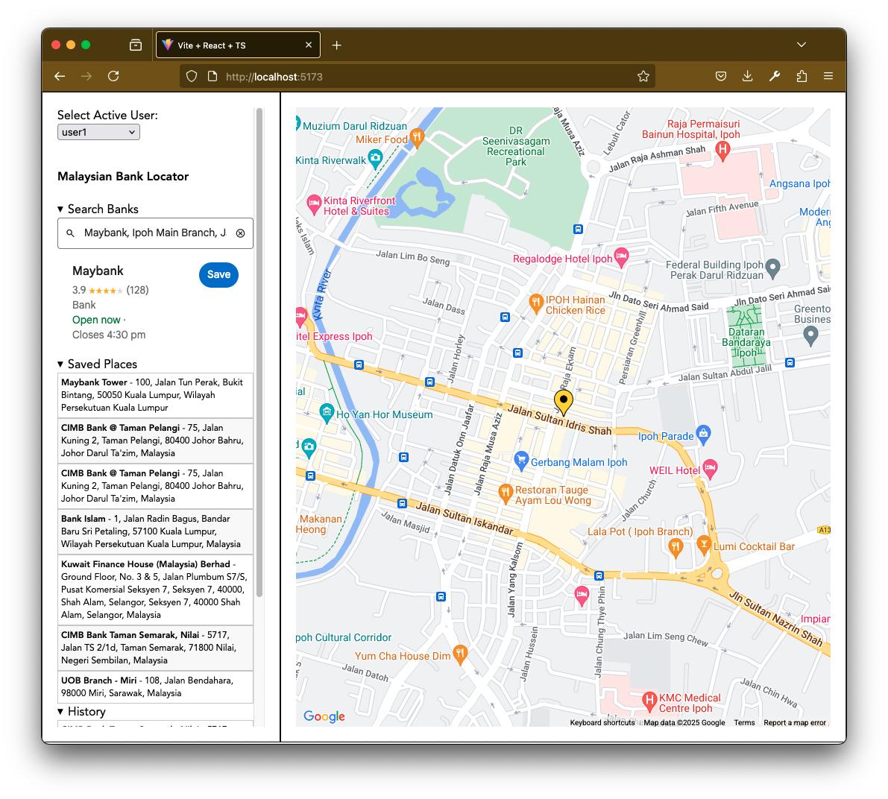

# Bank Locator using Google Map API

A dashboard to locate banks in Malaysia. User can save the locations as well as keep the search history. This project uses Google Map API.

## Usage

* Run the backend server (Spring Boot Application).
```bash
cd backend
./gradlew bootRun
```
* Create .env file in frontend directory
```javascript
// frontend/.env
VITE_GOOGLE_API_KEY=<YOUR_GOOGLE_API_KEY>
```
* Run in development mode (ReactJS).
```bash
cd frontend
npm i
npm run dev
```

## Backend APIs
| API Endpoint          | Method | Description                     |Security Level |
|-----------------------|--------|---------------------------------|---------------|
| `/api/users`          | GET    | Retrieve a list of users        | Public        |
| `/api/locations`      | GET    | Retrieve locations by user      | Basic Auth    |
| `/api/locations`      | POST   | Save location by user           | Basic Auth    | 

## Snapshots
* Three preloaded users are available (user1, user2, user3).
* Select active user to show saved places on the map.

* Search in autocomplete input.

* Selected location will be shown in the map.
* Click 'Save' to save the location in the database.


## References

### Google Map API
* https://github.com/visgl/react-google-maps/blob/main/examples/extended-component-library/src/app.tsx
* https://visgl.github.io/react-google-maps/examples/extended-component-library

### Redux Toolkit
* https://redux-toolkit.js.org/
